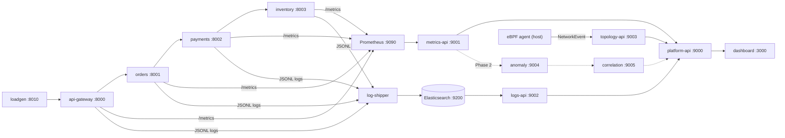

# Mini Datadog: Phase Plan, Deliverables & Demo Script

## 0. Assumptions (correct me if wrong)

- Your report has 4 reviews (Phase I R1 pitch, Phase I R2 25% demo, Phase II R1 60% prototype, Phase II R2 final). I've mapped your **3 build phases** onto them:

| Build phase | Maps to | Goal | Supervisor sees |
|---|---|---|---|
| **Phase 1** | Phase I - Review 2 (25% demo) | Real data flowing: services → metrics/logs/eBPF events → dashboard, one injected fault visible | **Live working demo** |
| **Phase 2** | Phase II - Review 1 (~60%) | Anomaly detection, topology graph, first correlated incident, Docker Compose | Integrated prototype |
| **Phase 3** | Phase II - Review 2 (final) | Unified incidents, tuned rules, experiments + measurements, K8s, report | Validated system |

- Review 1 (idea pitch/slides) is already done or handled separately.
- Team split follows your document. Rahul and Dev share "Metrics + anomaly detection", so I split it as **Rahul = metrics pipeline + Metrics API**, **Dev = dummy microservices/fault injection/load generator (Phase 1), then anomaly detector (Phase 2+)**. Dev would otherwise be idle in Phase 1, since anomaly detection isn't a Phase 1 requirement, and someone has to build the services everything depends on.
- Stack (chosen so all agents produce compatible code): **Python 3.11 + FastAPI + pydantic v2** for all backends, **React + TypeScript + Vite + Recharts** for the dashboard, **Prometheus** for time-series, **Elasticsearch 8** for logs, **BCC (Python)** for eBPF, **Docker Compose**.
- Monitored flow (as in your doc): `loadgen → API Gateway → Orders → Payments → Inventory`.
- Everything runs on **one Linux machine/VM** (Ubuntu 22.04/24.04, ≥8 GB RAM, ≥4 vCPU), because eBPF needs a real Linux kernel. See risks.

## 1. Architecture

## 2. Ownership

| Person | Folders they own | Ports |
|---|---|---|
| **Darsan** (Platform + dashboard) | `contracts/`, `platform_api/`, `dashboard/`, `deploy/`, `scripts/` (except `scripts/faults/`), CI | 9000, 3000 |
| **Rahul** (Metrics) | `metrics/` | 9001, 9090 |
| **Dev** (Services, later anomaly) | `services/`, `scripts/faults/`, later `anomaly/` | 8000-8003, 8010, later 9004 |
| **Diya** (Logs, later correlation) | `logs/`, later `correlation/` | 9002, 9200, later 9005 |
| **Brajesh** (eBPF + topology) | `ebpf/`, `topology/` | 9003 |

Rule: **nobody edits another person's folder.** Need a change? Open an issue or PR for the owner. `contracts/` changes need all 5 approvals (see contracts doc, section 10).

## 3. PHASE 1 deliverables (the demo)

Every item lists **"Done when"**, which is what you can show the supervisor. Nothing counts unless it runs on real data.

### Darsan
1. **Contracts package v1.0.0** (by D1, blocks everyone): pydantic models, generated JSON Schema and TS types, fixtures, `registry.yaml`, CI contract tests. *Done when:* all 4 others can `pip install -e contracts/python` and import models.
2. **`deploy/docker-compose.yml` + Makefile**: `make demo` starts everything and waits for health. *Done when:* from a clean clone, all containers healthy in under 3 minutes.
3. **Platform API :9000**: transparent proxy to all backends, `/services`, `/health/all`, `/demo/fault`. *Done when:* the dashboard uses only this one base URL.
4. **Dashboard, 4 screens + controls**: Overview (health cards), Metrics (time-series), Logs (search/filter/live tail), Network/eBPF (live events + basic topology diagram), Demo Controls (inject/clear fault). A greyed "Incidents: Phase 2 (planned)" tab. *Done when:* every number on screen comes from a live API, and there is a `VITE_MOCK=true` mode so work isn't blocked.
5. **`make smoke`**: validates every Platform API response against the models. Run it at each checkpoint. It is the integration referee.

### Rahul
1. **Prometheus config**: scrapes the 4 services every 5s, attaches a `service` label. *Done when:* the Prometheus UI shows all 4 targets UP.
2. **Metrics API :9001**: `/metrics/query`, `/metrics/latest` returning canonical metrics (`request_rate`, `latency_p95_ms`, `error_rate`, `cpu_percent`, `memory_mb`) using the exact PromQL in the contracts doc. *Done when:* 5 metrics × 4 services return valid `MetricSeries`; a latency fault shows in `latency_p95_ms` within 30s.
3. **Mock mode (`MOCK=true`) by D3** so Darsan can build the UI.
4. `docs/metrics.md`: definition of each metric (goes in the report).

### Dev
1. **`services/common` library**: JSON logger (to JSONL file), request-ID propagation, Prometheus middleware, fault-injection state, `/health`, `/metrics`, `/admin/fault`.
2. **4 dummy services** with realistic, stable baseline behaviour (payments ≈ 50 ms, as in your doc). *Done when:* `POST /orders` on the gateway returns 201 through the whole chain.
3. **Load generator :8010** (baseline 5 rps, surge profile).
4. **Fault scripts**: latency, error burst, and connection refusal (`stop payments`), plus restore. *Done when:* each fault has a visible effect in metrics and logs.
5. Publish a sample log file to Diya by D2 and a runnable stack to everyone by D4. Dev is the critical path for real data.

### Diya
1. **Elasticsearch index template + log shipper**: tails the JSONL files, validates against `LogRecord`, bulk-indexes idempotently, survives an ES restart. Reuse your existing LogStream code inside the shipper. *Done when:* the log count in ES matches the lines written.
2. **Logs API :9002**: `/logs/search` (service, severity, text, time range, pagination), `/logs/around` (timestamp window, which Phase 2 correlation needs), `/logs/stats`. *Done when:* the dashboard's filters all work; search p95 < 300 ms.
3. Mock mode by D3.

### Brajesh
1. **eBPF agent** (Linux, BCC): captures TCP connect / accept / close / connect-failed, resolves them to service names, emits `NetworkEvent`s, and has a `--pretty` terminal mode for the demo. *Done when:* it shows `api-gateway→orders`, `orders→payments`, `payments→inventory` live, and a **CONNECT_FAILED (ECONNREFUSED)** when payments is stopped.
2. **Topology API :9003**: ingests events, exposes `/network-events` and a basic `/topology` (nodes and edges). *Done when:* it returns the 4 service nodes + loadgen and the 3-4 edges, with correct counts.
3. `docs/ebpf-setup.md` and committed sample event files (your "eBPF network-event sample" evidence).
4. **Environment check on the demo machine by D2**, not on D12.

## 4. Phase 2 and Phase 3 (frozen in the interfaces now, built later)

| Person | Phase 2 (integrated prototype) | Phase 3 (final) |
|---|---|---|
| Darsan | Topology graph view, incident list/detail, loadgen controls, full Compose | Full navigation, K8s manifests (verified on kind/minikube), config management, error handling, evaluation export, report screenshots |
| Rahul | Gap/missing-data handling, retries, `ingest` endpoint, baseline-friendly queries for the detector | API latency benchmarks, retention/config, resource overhead measurement |
| Dev | **Anomaly detector** (rolling baseline + z-score, consecutive-breach + cooldown), `/anomalies`, pushes to correlation | Threshold tuning, experiment harness (latency spike, error burst, connection refusal, traffic surge), detection-latency and false-positive measurement |
| Diya | **Correlation engine**: anomaly → nearby logs + network events → scored `Incident` | Ranking/window tuning, incident-construction latency, dedupe/edge cases |
| Brajesh | Edge aging (ACTIVE/STALE), persistence, failed-connection counters | Registry-based IP/port mapping hardening, agent overhead measurement, K8s DaemonSet |

## 5. Timeline for Phase 1 (working days from kickoff; compress to your real deadline, keep the order)

| Day | Checkpoint |
|---|---|
| **D0-D1** | **C0: contract freeze.** Darsan publishes v1.0.0. Everyone reviews and signs off. Brajesh checks eBPF works in the demo environment. |
| D1-D4 | Everyone builds their service against fixtures/mocks. Dev delivers the runnable dummy stack by D4. |
| **D5** | **C1: standalone contract tests pass** for every service (`pytest tests/test_contract.py`). |
| D6-D9 | Real integration in Compose: metrics + logs visible in the dashboard. |
| **D10** | **C2: full stack, one command, fault injection visible end to end** (`make smoke` green). |
| D11-D12 | **C3: eBPF integrated** into the dashboard, polish, empty/error states, fixes. |
| **D13** | **C4: feature freeze.** `git tag phase1-demo`. Only bug fixes after this. |
| D14-D15 | Rehearse 3 times, record a backup video, prepare the slide and Q&A. |

## 6. Phase 1 demo script (about 8 minutes)

Start the stack **at least 10 minutes before** so the graphs have history.

| # | Action | Supervisor sees | Backed by |
|---|---|---|---|
| 1 | One slide: the architecture, coloured **LIVE now** vs **PLANNED** (anomaly detection, correlation, incidents) | Honest scope | Everyone |
| 2 | Overview screen | 4 services healthy, live req/s, p95, error % | Darsan, Rahul, Dev |
| 3 | Metrics screen: switch services and time ranges | Real time-series, updating | Rahul |
| 4 | Logs screen: filter `payments` + `ERROR`, click a `request_id` | The same request traced across services | Diya, Dev |
| 5 | Network screen next to a terminal running the agent in `--pretty` mode | Raw kernel-level connections resolved into `orders → payments`, with no tracing library in the services | Brajesh |
| 6 | **Inject latency**: Demo Controls, payments +800 ms | p95 jumps within ~30 s, WARN "slow request" logs appear, connection durations lengthen | All |
| 7 | **Connection refusal**: `make fault-refuse` | CONNECT_FAILED events, error rate spike, ERROR logs "connection refused" | All |
| 8 | Restore | Metrics recover | All |
| 9 | Show the schema examples and the git commit history | Contracts + module progress evidence | Darsan |
| 10 | State it explicitly: "Automatic anomaly detection and correlation are Phase 2." | You are labelling planned work as planned | Everyone |

**"Presentable" checklist**
- One command starts everything and the demo works on a clean clone.
- No hard-coded numbers; every screen has loading, empty, and error states.
- Dashboard readable at 1080p on a projector; dark theme with severity colours.
- Backup: a screen recording of the full run, and a pre-captured `events.jsonl`. If eBPF fails live, say so and show the recording, clearly labelled as recorded.
- Rehearsed 3 times, with a fault-then-restore reset that takes under 30 s.

**Likely strict questions to prep**
- Why eBPF instead of tracing libraries? (No code changes, kernel-level visibility, works for any language.)
- How do you map IPs/ports to service names? (Registry ports + `SERVICE_NAME` of the connecting process.)
- Why Prometheus and Elasticsearch?
- What happens if Elasticsearch or the agent dies?
- How will you detect anomalies? (Rolling baseline, z-score, consecutive breaches; see the Phase 2 spec.)
- What isn't finished yet, and when will it be?

## 7. Risks

| Risk | Mitigation |
|---|---|
| eBPF doesn't work on Windows/WSL2/Mac | Use a native Ubuntu VM or dual-boot; verify by D2; keep the recording backup |
| Elasticsearch is memory-hungry | Single node, 512 MB heap, ≥8 GB RAM machine; test on the exact demo machine |
| Contract drift | Pydantic models are the only source of truth; contract tests in CI; `make smoke` at every checkpoint |
| Darsan is the bottleneck (contracts, compose, API, dashboard) | Contracts done in D0-D1; dashboard has mock mode; Dev helps with Compose once the services are done |
| Connection pooling hides eBPF events | Dummy services disable HTTP keep-alive by default (documented in Dev's brief) |
| Late-integration surprises | The C1/C2/C3 checkpoints exist so the first integration is not in the last week |
